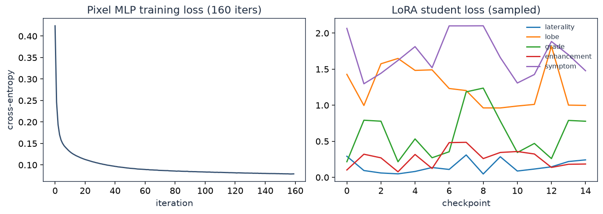
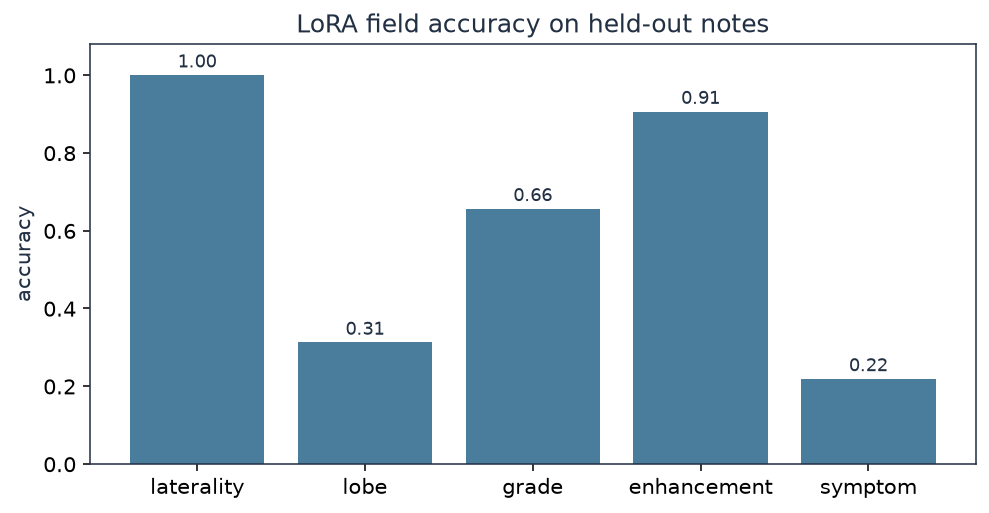

# GliomaGate

One axial MRI-like slice and a short consult note go in. The output is a tumor overlay, a structured report, and an evidence ledger.

Each field is tagged `image`, `retrieval`, or `ungrounded`. WHO grade is not allowed to come from the slice alone. If the note says left and the mask centroid is right, that is recorded as a contradiction rather than averaged away.

I built this as a public, fully runnable version of the slice-plus-note loop I work on in neuro-oncology. The images are synthetic, not BraTS, so nothing gated has to live in the repo.

**Demo:** [huggingface.co/spaces/Parisa/gliomagate](https://huggingface.co/spaces/Parisa/gliomagate)  
**Notebook:** [notebooks/gliomagate_results.ipynb](notebooks/gliomagate_results.ipynb)

## Data

80 train / 32 test slices, 128×128. Each case has an ellipsoidal enhancing core, an edema halo, a bias field, and noise, plus a paraphrased consult note (laterality, lobe, grade, enhancement, symptom). Grade 4 is more common and more often enhancing. The generator is `app/synth.py`.

## Training

```text
python scripts/train.py
```

This writes `models/segmenter.joblib`, the LoRA adapters (`models/lora_*.npz`), `models/train_log.json`, and the held-out scores in `models/metrics.json`.

**Segmenter.** Multi-scale conv stem (Gaussian, Sobel, xy coordinates) and a per-pixel MLP. Largest connected component at test time. Fit on 238,866 subsampled pixels, 160 iterations, cross-entropy 0.42 → 0.079. Train Dice **0.86**.

**Extractor.** Hash embeddings of the note and the image findings. A rank-8 teacher is trained first; the served student is rank-4 LoRA on a frozen 4-bit-style base, \(y = xW_q + xAB\).

| Split | laterality | lobe | grade | enhancement | symptom |
| --- | ---: | ---: | ---: | ---: | ---: |
| train | 0.99 | 0.50 | 0.81 | 0.94 | 0.51 |
| test | 1.00 | 0.31 | 0.66 | 0.91 | 0.22 |

Laterality is easy: the mask centroid and the note usually agree. Lobe and symptom stay lower because the notes are paraphrased, not a single template.



*Left: pixel MLP loss. Right: LoRA student loss per field (sampled during SGD).*

## Held-out results (n = 32)

From `models/metrics.json` after training.

| Metric | Score |
| --- | ---: |
| Mean tumor Dice (edema + core) | 0.77 |
| LoRA field accuracy (mean of 5 fields) | 0.62 |
| nDCG@5 | 0.80 |
| Recall@5 (grade-relevant chunk) | 0.81 |
| Grounded fraction | 0.86 |
| Grounded fraction without retrieval | 0.34 |
| Contradiction rate | 0.00 |
| p50 / p95 latency | 29 / 36 ms |





*Top: input. Middle: ground-truth mask (edema = 1, core = 2). Bottom: overlay (teal edema, red core).*


## Method

**Grounding.** Laterality and enhancement may be image-grounded. Grade may only be retrieval-grounded (TF-IDF over a small WHO-style guideline set in `app/rag.py`). Missing both sources → `ungrounded`.

**Serving.** FastAPI app on port 7860. `POST /v1/infer` returns the overlay, the ledger, retrieved chunks, and `latency_ms`. `GET /` is the demo UI. `GET /metrics` is Prometheus.

This is a 2D slice model, not a 3D nnU-Net, and the Dice is on synthetic ellipses. `training/train_qlora_t5.py` is a Flan-T5 QLoRA path for a GPU box; it exits cleanly if CUDA is not there.

## Run

```text
python -m pip install -r requirements.txt
python scripts/train.py
python scripts/make_figures.py
python scripts/build_notebook.py
python -m uvicorn app.main:app --port 7860
python -m pytest -q --cov=app --cov-fail-under=80
python scripts/bench.py
```

http://127.0.0.1:7860

```text
docker build -t gliomagate .
docker run --rm -p 7860:7860 gliomagate
```

GCP template: `deploy/cloudrun.yaml`.

## Layout

```text
app/            API, segmenter, LoRA, RAG, grounding, synthetic data
scripts/        train, figures, bench, notebook
notebooks/      gliomagate_results.ipynb
docs/figures/   training curves, gallery, Dice, ablation, ledger, latency
models/         weights, train_log.json, metrics.json, bench.json
data/test/      32 held-out cases
training/       Flan-T5 QLoRA (GPU)
deploy/
tests/
```

MIT License
