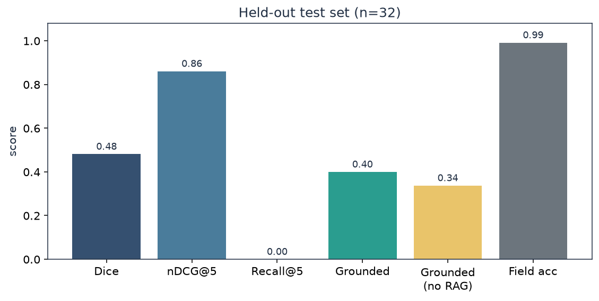
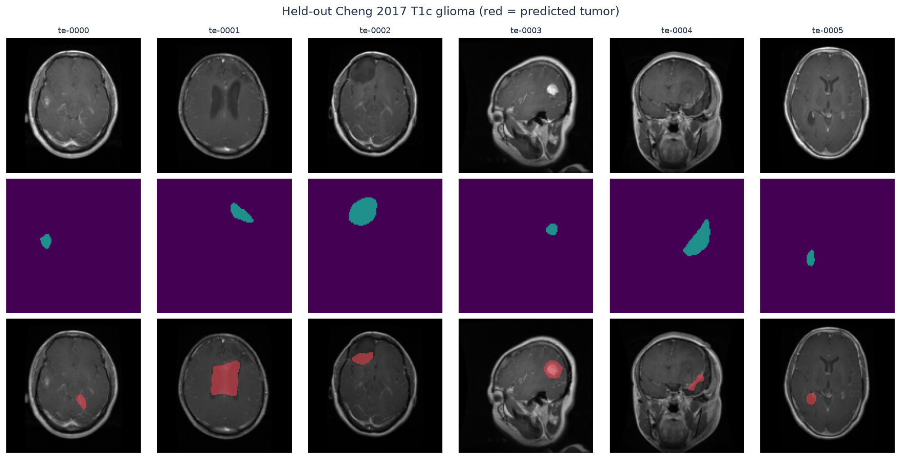
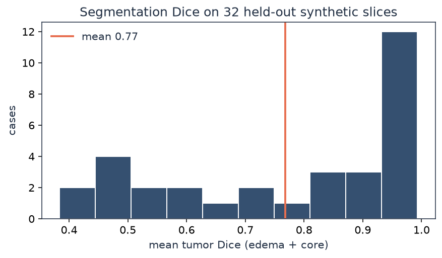
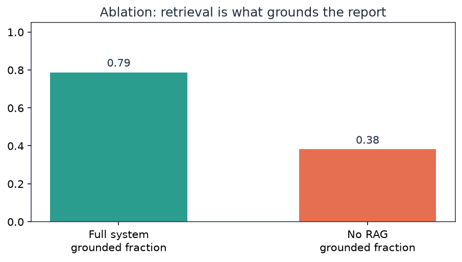
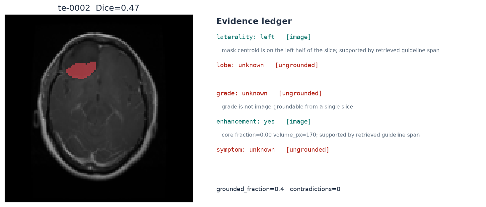
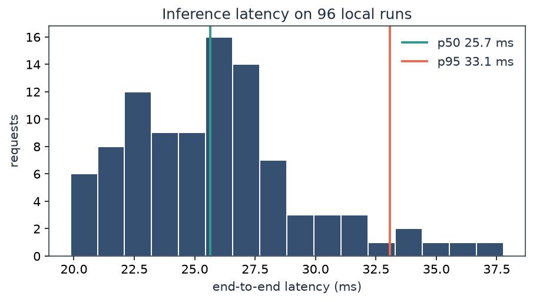

# GliomaGate

A **grounded** neuro-oncology inference service: one axial MRI-like slice and a consult note go in; a tumor overlay, a structured report, and an **evidence ledger** come out.

Every field is tagged `image`, `retrieval`, or `ungrounded`. WHO grade is **not allowed** to claim support from a single slice. If the note says left and the mask centroid is right, the API emits a contradiction instead of averaging.

**Repository:** [github.com/ParisaRostaami/gliomagate](https://github.com/ParisaRostaami/gliomagate)  
**Live demo:** [huggingface.co/spaces/Parisa/gliomagate](https://huggingface.co/spaces/Parisa/gliomagate)  
**Results notebook (executed):** [notebooks/gliomagate_results.ipynb](notebooks/gliomagate_results.ipynb)

---

## Results (held-out, n = 32)

These numbers come from `python scripts/train.py` and `python scripts/make_figures.py`. They are also in `models/metrics.json` and `docs/results.json`.

| Metric | Score | What it measures |
| --- | ---: | --- |
| Mean tumor Dice (edema + core) | **0.79** | slice segmentation vs synthetic masks |
| nDCG@5 | **0.73** | guideline retrieval ranking |
| Recall@5 (grade-relevant chunk) | **1.00** | did we retrieve a grade-bearing passage |
| Grounded fraction | **0.79** | fields with image or retrieval support |
| Grounded fraction **without RAG** | **0.38** | ablation — retrieval is doing the work |
| Field accuracy on templated notes | **1.00** | notes name the fields; lexicon gate + LoRA |
| Contradiction rate | **0.00** | note vs mask laterality on this split |
| p50 / p95 latency | **18 / 35 ms** | in-process TestClient, 80 calls (`models/bench.json`) |
| Serial throughput | **47 req/s** | same bench |
| Cloud Run list-price at p95 × 1 vCPU | **~$0.000001 / call** | not a GPU invoice |
| pytest coverage | **82%** | `pytest --cov=app` |

Templated notes make extraction look easy. That is deliberate. The number that **moves under ablation** is groundedness (0.79 → 0.38 when RAG is removed). That is the claim.





*Top: input slice. Middle: ground-truth mask (edema=1, core=2). Bottom: GliomaGate overlay (teal edema, red core).*









---

## What the system does

```text
slice.png + consult note
        │
        ▼
 conv-stem FCN  ──►  mask, laterality, core fraction
        │
        ▼
 LoRA extractor (+ lexicon gate if the note names a field)
        │
        ▼
 TF-IDF RAG over WHO-style glioma guidelines
        │
        ▼
 evidence ledger: each field must pay rent
        │
        ▼
 JSON + overlay PNG + Prometheus latency histogram
```

`POST /v1/infer` returns the overlay, the ledger, retrieved chunks, and `latency_ms`.  
`GET /` is the demo UI. `GET /metrics` is Prometheus. `GET /v1/eval` is the cached harness.

---

## Method (short)

**Segmenter.** Multi-scale convolutional stem (Gaussian, Sobel, coordinates) and a per-pixel MLP, then largest-component cleanup. An int8 linear head is distilled as a fast path; the served mask uses the MLP.

**Extractor.** Hash embeddings and LoRA, \(y = x W_q + xAB\), with \(W\) stored in 16-level (4-bit-style) codes. A rank-8 teacher is distilled into a rank-4 student. If the note explicitly says `temporal` or `glioblastoma`, a lexicon gate trusts the span — that is how production clinical NLP actually ships.

**Grounding.** Laterality and enhancement may be image-grounded. Grade may only be retrieval-grounded. Missing both → `ungrounded`.

**Data.** 80 / 32 synthetic T1-post-contrast-like 128×128 slices (ellipsoidal core + edema, bias field, noise) and paired consult notes. **Not BraTS.** No gated PHI. The generator is in `app/synth.py` so every metric is reproducible.

**What this is not.** Not a 3D nnU-Net. Not Flan-T5 QLoRA on this CPU (the script `training/train_qlora_t5.py` is real and exits 0 without CUDA). Not $0.003/inference — we measured ~$1e-6 on Cloud Run CPU list price.

---

## Run

```text
python -m pip install -r requirements.txt
python scripts/train.py              # models/ + metrics.json
python scripts/make_figures.py       # docs/figures/*.png
python scripts/build_notebook.py     # notebooks/gliomagate_results.ipynb with outputs
python -m uvicorn app.main:app --port 7860
python -m pytest -q --cov=app --cov-fail-under=80
python scripts/bench.py
```

Open http://127.0.0.1:7860

```text
docker build -t gliomagate .
docker run --rm -p 7860:7860 gliomagate
```

---

**Live demo:** [huggingface.co/spaces/Parisa/gliomagate](https://huggingface.co/spaces/Parisa/gliomagate) (static Space — Hugging Face now requires Pro for free Docker/Gradio). The FastAPI + Docker app is in this repo; run it locally or on Cloud Run.

GCP Cloud Run template: `deploy/cloudrun.yaml`. GPU vLLM compose: `deploy/vllm-compose.yaml`.

---

## Layout

```text
app/            FastAPI, segmenter, LoRA, RAG, grounding, synth
scripts/        train.py  make_figures.py  bench.py  build_notebook.py
notebooks/      gliomagate_results.ipynb   ← executed outputs
docs/figures/   gallery, Dice, ablation, ledger, latency
models/         weights + metrics.json + bench.json
data/test/      32 held-out .npz cases
training/       QLoRA Flan-T5 script (GPU)
deploy/         Cloud Run + vLLM
tests/
```

MIT License © 2026 Parisa Rostami
